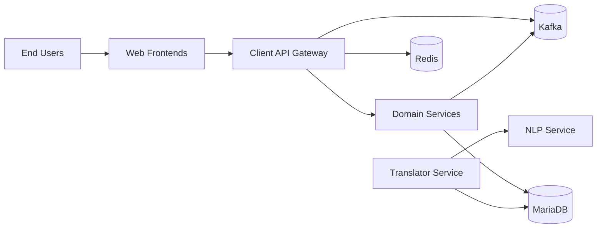
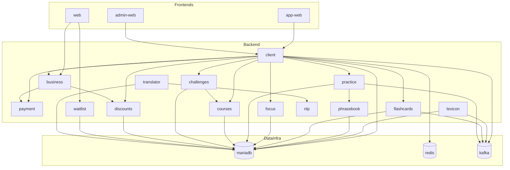

# System Architecture

This page documents the system context, container relationships, and interaction flows.

## C4 Level 1 - System Context

## C4 Level 2 - Container/Service View

## Interaction Flows

### Request Flow (User Feature Path)

1. User request hits frontend (`web`, `app-web`, or `admin-web`).
2. Frontend calls `client` or domain service endpoint.
3. `client` orchestrates across domain services (`focus`, `practice`, `courses`, `challenges`, `payment`, `business`, `discounts`).
4. Services persist/query MariaDB, and some services publish/consume Kafka events.
5. Response returns through frontend to user.

### Event Flow (Async Path)

1. Producer service emits event to Kafka.
2. Consumer service group reads and processes event.
3. Consumer persists resulting state to MariaDB.
4. Client-facing APIs expose updated state on subsequent reads.

## Service Catalog

| Service | Depends On | Inbound Interface | Outbound Interface | Data Stores | Owner |
| --- | --- | --- | --- | --- | --- |
| `web` | `business`, `waitlist` | HTTP (browser) | HTTP to backend services | None | TBD |
| `app-web` | `client` | HTTP (browser) | HTTP to `client` | None | TBD |
| `admin-web` | `client` | HTTP (browser) | HTTP to `client` | None | TBD |
| `client` | `mariadb`, `kafka`, domain services | HTTP API | HTTP to domain services, Kafka, Redis | MariaDB, Redis | TBD |
| `translator` | `mariadb`, `kafka`, `nlp` | HTTP API | HTTP to `nlp`, Kafka/DB interactions | MariaDB | TBD |
| `nlp` | none | HTTP API | none | None | TBD |
| `lexicon` | `mariadb`, `kafka` | HTTP/API/consumer | Kafka + DB operations | MariaDB | TBD |
| `phrasebook` | `mariadb` | HTTP API | DB operations | MariaDB | TBD |
| `flashcards` | `mariadb`, `kafka` | HTTP/API/consumer | Kafka + DB operations | MariaDB | TBD |
| `focus` | `mariadb` | HTTP API | DB operations | MariaDB | TBD |
| `practice` | `mariadb`, `kafka`, `phrasebook` | HTTP API | HTTP to `phrasebook`, Kafka + DB | MariaDB | TBD |
| `courses` | `mariadb` | HTTP API | DB operations | MariaDB | TBD |
| `challenges` | `mariadb`, `courses` | HTTP API | HTTP to `courses`, DB operations | MariaDB | TBD |
| `payment` | none | HTTP API | payment integrations | None/External | TBD |
| `discounts` | `mariadb` | HTTP API | DB operations | MariaDB | TBD |
| `business` | `payment`, `discounts` | HTTP API | HTTP to `payment`/`discounts` | None | TBD |
| `waitlist` | `mariadb` | HTTP API | DB operations | MariaDB | TBD |
| `mariadb` | none | SQL | none | persistent volume | Platform |
| `redis` | none | Redis protocol | none | persistent volume | Platform |
| `kafka` | `zookeeper` | Kafka protocol | none | broker log storage | Platform |
| `kafka-ui` | `kafka` | HTTP UI | Kafka admin client | none | Platform |
| `zookeeper` | none | coordination | none | local state | Platform |

## Architecture Contract

When a PR changes service boundaries, dependencies, integration paths, or core runtime topology:

- Update this page, or
- Add an ADR in `docs/adr/` and link it in the PR.
