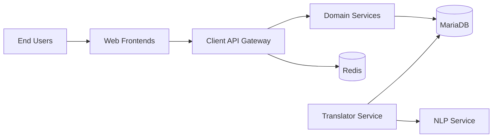
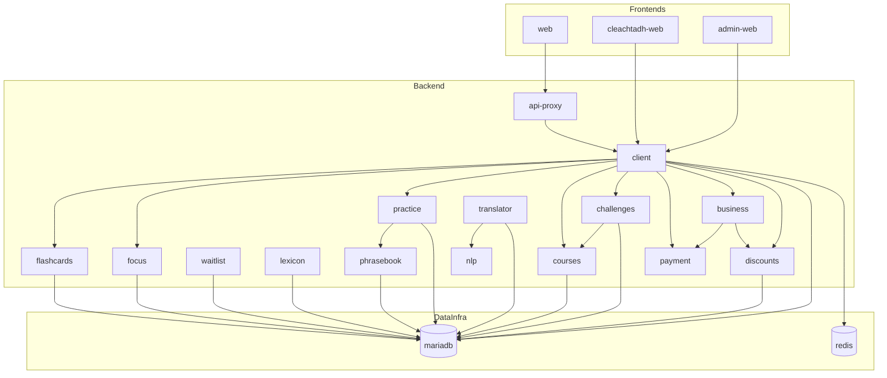

# System Architecture

This page documents the system context, container relationships, and interaction flows.

## C4 Level 1 - System Context

## C4 Level 2 - Container/Service View

## Interaction Flows

### Request Flow (User Feature Path)

1. User request hits frontend (`web`, `cleachtadh-web`, or `admin-web`).
2. Frontend calls `client` API endpoints.
3. `client` orchestrates across domain services (`focus`, `practice`, `courses`, `challenges`, `payment`, `business`, `discounts`).
4. Services persist/query MariaDB and call internal HTTP endpoints where needed.
5. Response returns through frontend to user.

## Service Catalog

| Service | Depends On | Inbound Interface | Outbound Interface | Data Stores | Owner |
| --- | --- | --- | --- | --- | --- |
| `web` | `client` | HTTP (browser) | HTTP to `client` | None | TBD |
| `cleachtadh-web` | `client` | HTTP (browser) | HTTP to `client` | None | TBD |
| `admin-web` | `client` | HTTP (browser) | HTTP to `client` | None | TBD |
| `api-proxy` | `client` | HTTP API ingress | HTTP proxy to `client` | None | TBD |
| `client` | `mariadb`, domain services | internal HTTP API | HTTP to domain services, Redis | MariaDB, Redis | TBD |
| `translator` | `mariadb`, `nlp` | HTTP API | HTTP to `nlp` and DB-backed translation persistence | MariaDB | TBD |
| `nlp` | none | HTTP API | none | None | TBD |
| `lexicon` | `mariadb` | HTTP API | HTTP to `nlp` + DB operations | MariaDB | TBD |
| `phrasebook` | `mariadb` | HTTP API | DB operations | MariaDB | TBD |
| `flashcards` | `mariadb` | HTTP API | HTTP to `lexicon` + DB operations | MariaDB | TBD |
| `focus` | `mariadb` | HTTP API | DB operations | MariaDB | TBD |
| `practice` | `mariadb`, `phrasebook` | HTTP API | HTTP to `phrasebook`/`lexicon` + DB | MariaDB | TBD |
| `courses` | `mariadb` | HTTP API | DB operations | MariaDB | TBD |
| `challenges` | `mariadb`, `courses` | HTTP API | HTTP to `courses`, DB operations | MariaDB | TBD |
| `payment` | none | HTTP API | payment integrations | None/External | TBD |
| `discounts` | `mariadb` | HTTP API | DB operations | MariaDB | TBD |
| `business` | `payment`, `discounts` | HTTP API | HTTP to `payment`/`discounts` | None | TBD |
| `waitlist` | `mariadb` | HTTP API | DB operations | MariaDB | TBD |
| `mariadb` | none | SQL | none | persistent volume | Platform |
| `redis` | none | Redis protocol | none | persistent volume | Platform |

## Architecture Contract

When a PR changes service boundaries, dependencies, integration paths, or core runtime topology:

- Update this page, or
- Add an ADR in `docs/adr/` and link it in the PR.

## API Error Contract

Public gateway routes exposed via `client` should return normalized error payloads:

- error shape: `{ "error": "<message>" }`
- status behavior:
  - preserve downstream 4xx/5xx status when proxying upstream service errors
  - return `502` for upstream reachability/network failures

## Topology Direction

Frontend ingress is consolidated through `client`:

- `web`, `cleachtadh-web`, and `admin-web` call `client` endpoints.
- Public API ingress should remain a single `client` entrypoint.
- Domain services remain internal-only.

Roadmap: [Single Entrypoint Roadmap](./single-entrypoint-roadmap.md)
